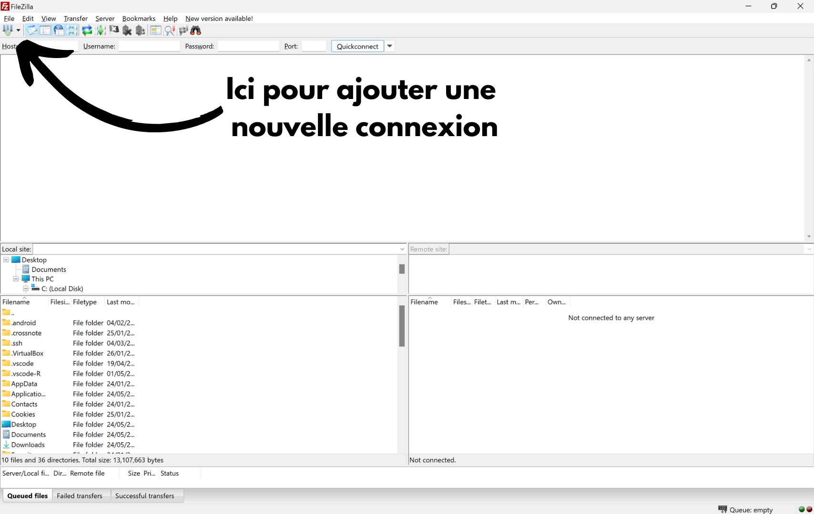
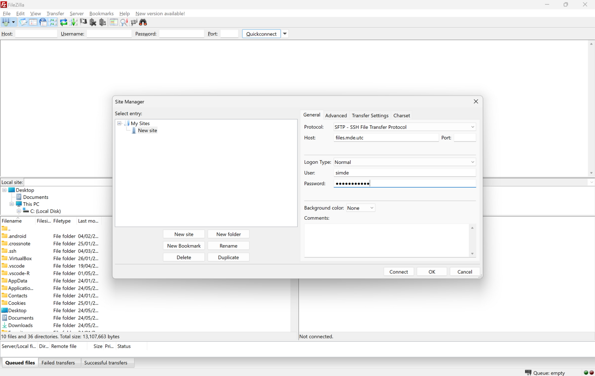

# Utilisation de l'espace numérique associatif

## Vue d'ensemble de l'architecture

L'infrastructure proposée par le SIMDE est composée de plusieurs machines interconnectées qui permettent à chaque asso de profiter d'un espace informatique, notamment utilisé pour héberger des sites web, web app, serveurs (containerisées ou non).

_Cette ressource a pris pour parti de se concentrer essentiellement sur les serveurs Laravel. Loin de supposer que Laravel est mieux que Rust, Node, Symfony... Mais c'est avant toute chose car_
- _Laravel c'est facile à comprendre, ça permet une formation rapide pour reprendre en mains les services proposés_
- _Laravel est utilisé dans la majorité des webapp / serveurs des assos utcéennes (Integ, Pic, SIMDE, Skiut...), une personne qui se forme sur Laravel à l'UTC pourra donc s'y retrouver sur à peu près tous les projets info._

### Architecture générale

L'infrastructure se compose de :

- **Serveur Nginx** : Point d'entrée principal qui reçoit toutes les requêtes HTTP/HTTPS
- **Machine Apache** : Serveur web capable d'exécuter du PHP et servir des fichiers (entre autres)
- **Machine Docker** : Serveur pour applications containerisées (utilisation rare)
- **Machine files.mde.etc** : Serveur de fichiers accessible aux associations

#### Flux des requêtes

1. Les requêtes arrivent sur le serveur **Nginx** (fait office de reverse proxy)
2. Nginx redirige les requêtes vers :
   - La machine **Apache** pour les sites webs ou serveurs PHP
   - La machine **Docker** pour les applications containerisées
3. La machine Apache récupère les fichiers depuis **files.mde.etc**

## Gestion des machines

### Machines gérées par le SIMDE

Les machines suivantes sont directement administrées par l'équipe SIMDE :
- Serveur Nginx
- Machine Apache
- Machine Docker

### Machine accessible aux associations

Seule la machine **files.mde.etc** est accessible aux associations pour déposer leurs fichiers et applications.

## Accès à l'infrastructure

⚠️ **Attention** : Pour se connecter en SFTP, SSH ou même à la base de données fournie à l'association, il faut utiliser le VPN fournit par l'UTC (ou directement être connecté à utcetu).

### Accès SFTP avec Filezilla

Les associations peuvent accéder à leurs fichiers via SFTP (en utilisant Filezilla par exemple).

**Configuration Filezilla :**
- **Protocole** : SFTP
- **Hôte** : files.mde.etc
- **Type d'authentification** : Normale
- **Identifiants** : Fournis par le SIMDE




#### Procédure de connexion SFTP

1. Ouvrir Filezilla
2. Saisir les identifiants fournis par le SIMDE
3. Se connecter au serveur files.mde.etc
4. Naviguer vers le dossier de votre association
5. Téléverser vos fichiers dans le dossier `public_html`

### Accès SSH

L'accès SSH à la machine files.mde.utc est disponible mais avec des limitations importantes garantissant la sécurité et la confidentialité des assos malgré un hébergement mutualisé sur la même VM

**Connexion SSH :**
```bash
ssh [votre-asso]@files.mde.etc
```

#### Limitations SSH

⚠️ **Attention** : Certaines commandes ne sont pas disponibles via SSH, notamment pour Laravel :
- `composer install` et autres commandes composer
- `php artisan migrate` et autres commandes php

**Conséquences pour Laravel :**
- Le dossier `vendor` doit être téléversé via SFTP
  - Les dépendances doivent être installées localement avant le déploiement ou via [d'autres méthodes](#problématique-des-dépendances)
- La base de données doit être migrée à la main, ou alors avec des méthodes [un peu moins conventionnelles](#exécution-de-code-php-sur-le-serveur)...

## Structure des URLs et déploiement

### Format des URLs

Les applications sont servies selon le format suivant :
```
https://assos.utc.fr/[nom-association]
```

**Exemples :**
- Ski'ut : `https://assos.utc.fr/skiutc`
- Pic'Asso : `https://assos.utc.fr/picasso`
  - Bon en vrai le pic c'est un peu une exception car ils ont reconfigurer pour servir sur `https://pic.assos.utc.fr`

Si vous développez un serveur, pensez donc bien à configurer son .env pour servir cette URL. Dans le cas contraire, vous risquez d'avoir quelques soucis de redirection...

## Stratégies de déploiement

### Sites web

Pour les sites web, c'est assez facile
1. Connectez-vous en SFTP
2. Envoyez tout le dossier dans public_html (en faisant en sorte que le fichier index soit accessible)

#### Tout de même

Si vous êtes motivé.e.s, vous pouvez mettre votre repo en public et créer un petit script shell pour cloner le repo et le déployer automatiquement (ça évite de se reconnecter en SFTP à chaque fois).
Pour cela il suffit de 
1. Créer un script en SSH ou en local et l'envoyer en SFTP
2. Lui donner les droits d'éxecution : `chmod 755 ./monScript.sh`

_Exemple de Script :_
```bash
#!/bin/bash

TARGET_DIR="./public_html"   # Si on met ce script à la racine du projet
REPO_URL="https://github.com/votreOrganisation/votreRepo.git"
BRANCH="main"

TMP_DIR="$(mktemp -d)"  

echo "Clonage du dépôt $REPO_URL (branche $BRANCH)..."
git clone --depth=1 --branch "$BRANCH" "$REPO_URL" "$TMP_DIR"

if [ $? -ne 0 ]; then
  echo "Erreur : échec du clonage du dépôt."
  exit 1
fi

rm -rf "$TARGET_DIR"/*
rsync -av --exclude='.git' "$TMP_DIR/" "$TARGET_DIR/"
rm -rf "$TMP_DIR"

echo "Déploiement terminé avec succès."
```

### Serveurs

Pour les serveurs, c'est un peu plus compliqué
1. Connectez-vous en SFTP
2. Envoyez tout votre serveur dans le dossier public_html
   - Cette étape peut être longue à cause du dossier du dépendances vendor/, on en reparle juste après
   - Pensez à bien modifier votre .env pour passer en mode APP_ENV=prod, APP_DEBUG=false et surtout APP_URL=`https://assos.utc.fr/tonAsso`
3. En théorie, ça devrait déjà tourner (pas besoin de faire php artisan serve, Apache tourne déjà pleine balle)

_Si vous êtes sur Laravel, pas besoin d'avoir index.php à la racine : il est dans le dossier public/ qui est accessible_

Il peut arriver que certains problèmes surviennent lors du déploiement de votre serveur
- Votre URL théorique ne trouve pas le fichier index
- Le index est trouvé mais le serveur
Cela peut être dûe à des mauvaises config de .htaccess ou de mauvaise version d'interpréteur sur les machines.
Dans ces deux cas (et probablement dans d'autres), vous ne pourrez pas faire grand chose et vous allez devoir [contacter le SIMDE](mailto:simde@assos.utc.fr).

#### Problématique des dépendances

Étant donné l'impossibilité d'utiliser `composer` directement sur le serveur, plusieurs stratégies sont recommandées :

### Solution recommandée : GitHub Actions

La meilleure pratique consiste à automatiser le build et le déploiement via GitHub Actions.

**Avantages :**
- Installation automatique des dépendances
- Build de l'application
- Les PR sont refusées en cas d'erreur
- Création d'un artifact (zip du projet) prêt au déploiement
- Déploiement automatisé

**Exemple d'implémentation :**
Consultez le [repo Ocktopus de Pic'Asso](https://github.com/picasso-utc/ocktopus)

Cette implémentation se base sur 2 composantes : 
- Une GitHub Action définie dans .github/actions/deploy.yml
- Une structure particulière dans /storage/app/deploy
  - Un fichier deploy.sh qui gère le déploiement (nécessite la [création d'un PAT Github](https://github.com/settings/personal-access-tokens))
  - Un dossier tmp pour extraire l'artifact avant de synchroniser les changements avec la prod

### Déploiement manuel

Si vous ne pouvez pas utiliser GitHub Actions :

1. **Localement :**
   ```bash
   composer install --no-dev --optimize-autoloader
   ```

2. **Téléversement SFTP :**
   - Téléverser tous les fichiers incluant le dossier `vendor`

## Exécution de code PHP sur le serveur

### Méthode 1 : Routes d'administration

Créer des routes spécifiques dans votre application pour exécuter du code :

**Exemple Laravel :**
```php
Route::get('/admin/migrate', function() {
    Artisan::call('migrate');
    return 'Migration terminée';
});
```

### Méthode 2 : Scripts à la racine

1. Placer un fichier `.php` ou `.sh` à la racine de votre application
2. L'exécuter via URL : `https://asso.etc.fr/[association]/script.php`

⚠️ **Sécurité** : Supprimer ces scripts directement après utilisation !

## Configuration serveur et support

### Modifications de configuration

Pour des besoins spécifiques (modification du `php.ini`, mise à jour de PHP, etc.), [contactez le SIMDE](mailto:simde@assos.utc.fr).

## Base de données

Le SIMDE fournit une base de données MySQL à chaque asso.

**Accès phpMyAdmin :**
- URL : [ici](https://phpmyadmin.assos.utc.fr)
- Identifiants : Fournis par le SIMDE

## OAuth 2.0

*[SECTION À RÉDIGER ULTÉRIEUREMENT]*

*[CONTENU OAUTH À AJOUTER]*

## Exemples et références

### Associations de référence

**Ski'ut :**
- [Organisation](https://github.com/ski-utc)
- [Serveur backend](https://github.com/ski-utc/server-SkiUt-P25)
- Utilisé comme référence pour la configuration Laravel
  - Documentation
  - Implémentation de l'OAuth dans app/Http/Controllers/AuthController.php

**Pic'Asso :**
- [Organisation](https://github.com/picasso-utc)
- [BackOffice Laravel](https://github.com/picasso-utc/ocktopus)
- Exemple d'implémentation GitHub Actions

## Bonnes pratiques

1. **Utiliser des .env** pour la configuration
2. **Toujours tester localement** avant le déploiement
3. **Versionner votre code** avec Git
4. **Documenter les spécificités** de votre déploiement
5. **Pensez à la passation**

## Contact SIMDE

Pour toute demande de modification de configuration : [contacter le SIMDE](mailto:simde@assos.utc.fr)

---

*Documentation mise à jour le : 24/05/2025*  
*Rédigé avec le <3 par Mathis Delmaere pour le SIMDE*